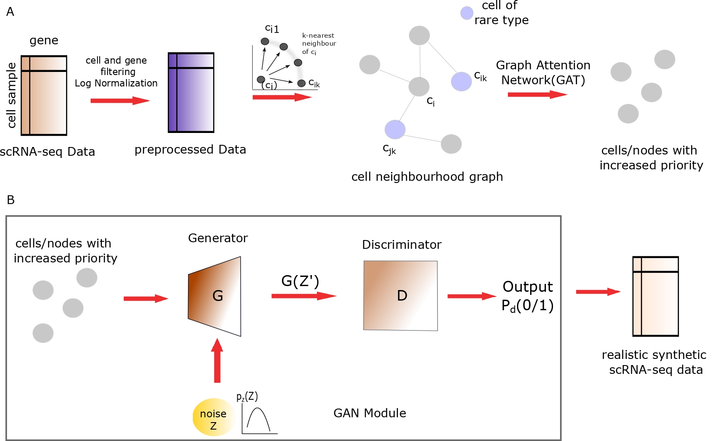

# GARAGE
**A Graph Attentive GAN for Rare Cell Aware single cell RNA-seq Data Generation**

  
  <h1 align="center">GARAGE</h1>

  <!-- CI Status -->
  

  
  
  <!-- Codecov Coverage -->
  
  
  <!-- License -->
  
  
  <!-- Documentation (if enabled) -->
  
  
  <!-- Gitter / Community Chat -->
  

  
  
  

---

