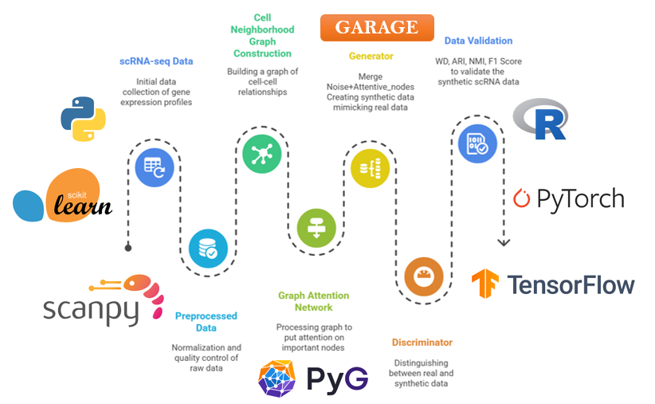

# GARAGE
## A Graph Attentive GAN for Rare Cell Aware single cell RNA-seq Data Generation

  
<!--   <h1 align="center">GARAGE</h1> -->

  

  <!-- Documentation (if enabled) -->
  

  <!-- License -->
  
  
  
  <!-- Gitter / Community Chat -->
  

  
  
  

---

**GARAGE** (**G**raph-**A**ttentive **RA**re-cell aware single-cell data **GE**neration) is a novel deep learning framework for generating high-fidelity synthetic single-cell RNA-seq (scRNA-seq) data.

Traditional Generative Adversarial Networks (GANs) often struggle with the high-dimensional and sparse nature of scRNA-seq data, leading to training instability, mode collapse, and a critical failure to reproduce rare but biologically important cell populations.

