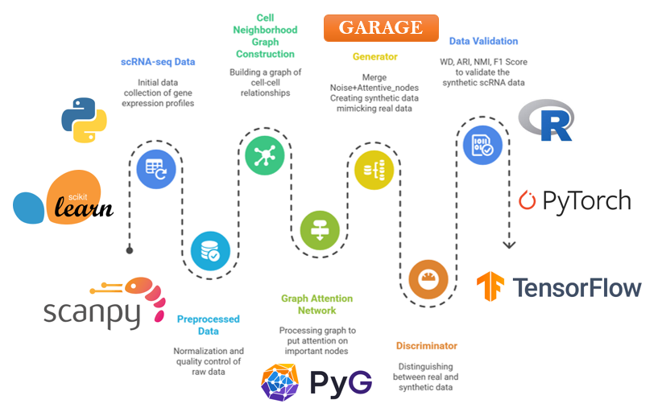
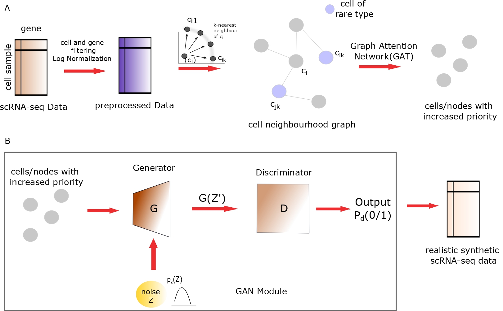

<p align="center">
  
</p>

<p align="center">

  <a href="https://www.python.org/downloads/release/python-3125/">
  
  </a>

  <a href="https://garage-docs.readthedocs.io/en/latest/">
    
  </a>

  <a href="https://github.com/RitwikGanguly/GARAGE/blob/main/LICENSE">
    
  </a>

  <a href="https://app.gitter.im/#/room/!FIUyTpwDzJtqorWCMm:gitter.im">
    
  </a>
</p>

<p align="center">
  
  
</p>

---

# GARAGE — Graph-Attentive Rare-cell-Aware single-cell RNA-seq Data Generation

A deep-learning framework for generating high-fidelity synthetic scRNA-seq data
with a specialised focus on preserving rare cell populations.

**Docs:** [garage-docs.readthedocs.io](https://garage-docs.readthedocs.io/en/latest/)

---

## Workflow

GARAGE uses a two-stage architecture:

<p align="center">
  
</p>

1. **Stage 1 — GAT-based Cell Selection:** A Graph Attention Network identifies
   archetypal "seed" cells via attention ranking on a KNN cell-cell graph.
2. **Stage 2 — GAT-Seeded GAN Generation:** The generator receives a hybrid
   input batch mixing random noise with the GAT-selected seeds, anchoring the
   generative process to biologically realistic states.

---

## Quick Start

```bash
git clone https://github.com/RitwikGanguly/GARAGE.git
cd GARAGE
conda create --name venv_garage python=3.12.5
conda activate venv_garage
pip install -r requirements_garage.txt

# Run the core pipeline on a single dataset
python -m data_generation.garage --dataset muraro

# Run the state-of-the-art benchmarks
python -m benchmarking.sota.gan --dataset muraro

# Validate generated data
python -m data_validation.data_validation \
    --dataset muraro \
    --gen_csv data/gen_data/muraro_data_mixdata_iter3_top_426.csv
```

---

## Repository Structure

```
├── data_generation/                Core GARAGE pipeline
│   ├── garage.py                   Full GARAGE: GAT subsampling + GAN generation
│   └── wasserstein_distance.py     Wasserstein distance real↔gen
│
├── data_validation/                Quality evaluation
│   ├── feature_selection.py        Python port of the R feature-selection (CV², Fano, PCA)
│   ├── feature_selection.R         Original R implementation (for reference)
│   ├── data_validation.py          Clustering (Leiden) → ARI / NMI / macro-F1 / UMAP
│   └── data_vaidation_garage.ipynb Original notebook (for reference)
│
├── benchmarking/
│   ├── sota/                       General-purpose generative baselines (PyTorch)
│   │   ├── gan.py                  Vanilla GAN (BCE, Adam)
│   │   ├── wgan.py                 Wasserstein GAN (RMSprop, weight clipping)
│   │   ├── fgan.py                 f-divergence GAN (Fisher ratio + constraint penalty)
│   │   ├── vae.py                  Variational Autoencoder (MSE + KL)
│   │   ├── lsh_gan.py             LSH-GAN (KNN subsample + GAN)
│   │   └── *_tf1.py               Original TF1.11 implementations (for reference)
│   └── scrna_seq_specific/         scRNA‑seq‑specific baselines (PyTorch)
│       ├── scgan.py               scGAN (WGAN‑GP, deep architecture)
│       ├── scvae.py               scVAE (β‑VAE, deep encoder/decoder)
│       ├── scdiffusion.py         scDiffusion (DDPM with MLP denoiser)
│       ├── gan_ros.py             GAN + Random Oversampling (ROS)
│       └── vae_ros.py             VAE + Random Oversampling (ROS)
│
├── biological_analysis/            Rare-cell biology experiments
│   ├── rare_cell_utility.py        Held‑out rare-cell classification utility
│   ├── marker_gene_clustering.py   Marker‑gene‑based clustering evaluation
│   └── biological_validation.py    GAT attention weights ↔ marker‑gene enrichment
│
├── ablation_study/                 Sensitivity experiments
│   ├── leakage_ablation.py         Varying GAT‑leakage fraction (0.0–0.3)
│   └── multi_seed_synthesis.py    Multi‑seed data generation (5 seeds × 4 datasets)
│
├── analysis/                       Post‑processing and plotting
│   ├── distribution_metrics.py     MMD + Sliced Wasserstein Distance
│   ├── clustering_evaluation.py    Feature‑selection + clustering across seeds
│   ├── sc_specific_benchmark.py   ARI/NMI/F1 for sc‑specific baselines
│   ├── aggregate_losses.py        Aggregate GAN loss records
│   ├── build_summary_tables.py    Build mean±std summary tables
│   ├── marker_clustering_grid.py  Grid‑search marker‑gene clustering
│   └── plot_wasserstein_vs_leakage.py  WD vs leakage figure
│
├── tnbc/                           TNBC interpretability experiments
│   ├── graph_main.py
│   ├── sub_8.py
│   └── explainability.py
│
├── data/                           Input data directory
│   ├── cell_types/.gitkeep         Cell‑type label files (*.csv)
│   └── expression_matrix/.gitkeep  Gene‑expression matrices (*.csv)
│
├── results/                        Output directory (generated CSVs, figures)
│
├── docs/                           ReadTheDocs documentation source
├── img/                            Images used in README and docs
├── config.py                       Shared paths and hyper‑parameter constants
├── CITATION.cff                    Citation metadata
├── LICENSE                         MIT License
├── requirements_garage.txt         Core dependencies (GARAGE pipeline + validation)
├── requirements_benchmarking.txt   Extra dependencies (benchmarking baselines)
└── README.md
```

---

## How to reproduce the paper results

### 1. Generate synthetic data

```bash
# GARAGE (all 4 datasets)
for d in yan pollen cbmc muraro; do
    python -m data_generation.garage --dataset $d
done

# SOTA baselines (5 methods × 4 datasets)
for d in yan pollen cbmc muraro; do
    python -m benchmarking.sota.gan --dataset $d
    python -m benchmarking.sota.wgan --dataset $d
    python -m benchmarking.sota.fgan --dataset $d
    python -m benchmarking.sota.vae --dataset $d
    python -m benchmarking.sota.lsh_gan --dataset $d
done

# scRNA‑seq‑specific baselines (5 methods × 4 datasets)
for d in yan pollen cbmc muraro; do
    python -m benchmarking.scrna_seq_specific.scgan --dataset $d
    python -m benchmarking.scrna_seq_specific.scvae --dataset $d
    python -m benchmarking.scrna_seq_specific.scdiffusion --dataset $d
    python -m benchmarking.scrna_seq_specific.gan_ros --dataset $d
    python -m benchmarking.scrna_seq_specific.vae_ros --dataset $d
done
```

### 2. Validate data quality

```bash
# Feature selection (CV²) + Leiden clustering + ARI/NMI/F1
python -m data_validation.data_validation --dataset muraro \
    --gen_csv data/gen_data/muraro_data_mixdata_iter3_top_426.csv

# Wasserstein distance
python -m data_generation.wasserstein_distance --dataset muraro \
    --gen_csv data/gen_data/muraro_data_mixdata_iter3_top_426.csv
```

### 3. Run biological and ablation studies

```bash
python biological_analysis/rare_cell_utility.py
python biological_analysis/marker_gene_clustering.py
python biological_analysis/biological_validation.py
python ablation_study/leakage_ablation.py
```

---

## Citation

```bibtex
@software{garage2025,
  author    = {Ganguly, Ritwik and others},
  title     = {GARAGE: Graph-Attentive Rare-cell-Aware single-cell RNA-seq Data Generation},
  year      = {2025},
  url       = {https://github.com/RitwikGanguly/GARAGE},
  doi       = {to be added}
}
```

---

## License

MIT License — see the [LICENSE](LICENSE) file.
