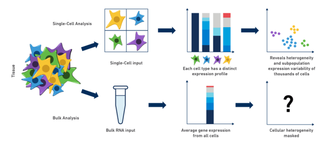

# Single Cell Clustering

## What is single-cell clustering?

Single-cell clustering is a computational technique that groups individual cells into clusters based on their gene expression profiles, enabling the identification of cell types and states from scRNA-seq data.

## Key Steps

1. **Data Preprocessing:** Remove noise, correct artefacts, and normalise expression values.
2. **Dimensionality Reduction:** Use PCA, t-SNE, or UMAP to reduce dimensionality.
3. **Clustering:** Apply K-means, hierarchical, density-based (DBSCAN), or graph-based methods (Leiden) for grouping cells.
4. **Visualisation:** Use UMAP plots to explore relationships between clusters.

## Applications

- **Cell type identification** — crucial for understanding tissue composition.
- **Disease subtyping** — reveal disease-specific cell subpopulations for conditions such as cancer.
- **Developmental biology** — track cell differentiation and developmental processes.
- **Immunology** — identify immune cell populations, discover rare types.
- **Drug discovery** — identify target cells and uncover resistance mechanisms.
- **Rare cell identification** — detect and characterise rare populations.

---

## scRNA-seq vs. Bulk RNA-seq

  

<small>Image source: <a href="https://www.10xgenomics.com/resources/blog/single-cell-vs-bulk-rna-seq">10x Genomics</a></small>

| Property | scRNA-seq | Bulk RNA-seq |
|----------|-----------|--------------|
| **Resolution** | Individual cells. | Average across all cells. |
| **Heterogeneity** | Detects cellular diversity. | Masks heterogeneity. |
| **Applications** | Complex tissues, rare cells. | Homogeneous samples. |
| **Data complexity** | High-dimensional, requires advanced methods. | Lower-dimensional, simpler to analyse. |
| **Cost** | Higher (single-cell isolation). | Lower (pooled RNA). |
| **Sensitivity** | Detects rare transcripts. | May miss rare transcripts. |

In summary, scRNA-seq provides high-resolution insights into cellular heterogeneity, making it the foundation for methods like GARAGE that aim to model and augment this diversity.
